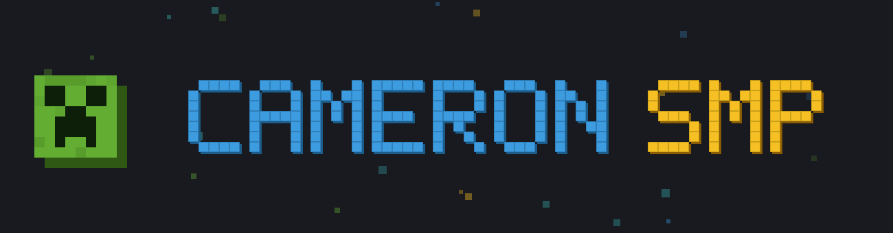

# Cameron SMP — MCPE Title Logo Pack

A Minecraft **Bedrock / Pocket Edition** resource pack that swaps the
"MINECRAFT" wordmark on the start-up screen for a pixel-art **CAMERON SMP**
banner with a creeper face.

## What it changes

It overrides a single texture, `textures/ui/title.png` — the logo Bedrock
draws on the main menu / load-up screen. The logo is supplied with a
transparent background so it sits cleanly over the menu panorama.

## Install (one tap)

1. Copy `CameronSMP.mcpack` to your device.
2. Tap it — Minecraft opens and imports the pack.
3. Go to **Settings → Global Resources → My Packs**, select **Cameron SMP**,
   and **Activate** it.
4. Back out to the main menu — the logo is now the Cameron SMP banner.

> Global Resources applies the pack everywhere, including the title screen.
> (Activating it inside a single world only affects that world, not the
> menu, so use Global Resources for the load-up screen.)

## Install (manual / folder)

Copy the `cameron-smp-texture-pack` folder into:

- **Android:** `Android/data/com.mojang.minecraftpe/files/games/com.mojang/resource_packs/`
- **Windows 10/11:** `%LOCALAPPDATA%/Packages/Microsoft.MinecraftUWP_8wekyb3d8bbwe/LocalState/games/com.mojang/resource_packs/`

Then activate it under **Settings → Global Resources**.

## Notes

- The texture path Bedrock uses for the menu logo has been `textures/ui/title.png`
  across recent versions. If a future update renames it, drop the same
  `title.png` at the new path — the artwork stays the same.
- `min_engine_version` is set to 1.20.0; lower it in `manifest.json` for older
  builds.
